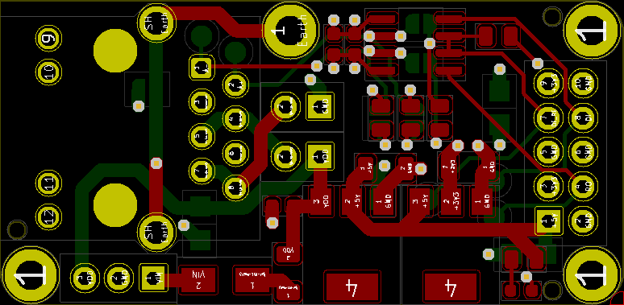
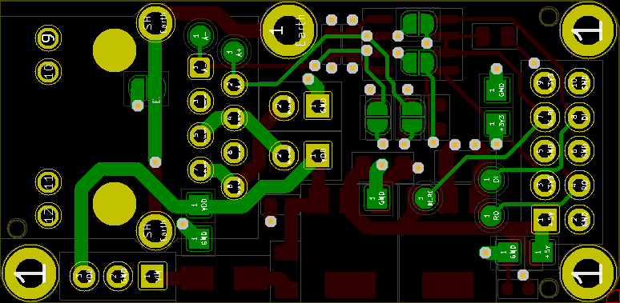

# μDiff: 10mbps over 1km on a single pair of wires

A simple 46mmx22.5mm module to route power and differential signals (RS-485) over RJ-45.

This project is also described in detail [on Hackaday.io](https://hackaday.io/project/179020-10mbps-over-1km-on-a-single-pair-of-wires)

It can be purchased as a kit **[from Tindie](https://www.tindie.com/products/24510/)**

 

This project is [certified open hardware](https://certification.oshwa.org/jp000009.html):

# How it works

μDiff provides an easy way to reliably transfer power and a digital signal over a long-distance using an inexpensive RJ-45 cable.

It uses RS-485 differential signaling and 802.3af Power-over-Ethernet pinouts to achieve this. It can accept an input voltage between 6.5V-12V, and provides outputs of 5V and 3.3V. All signals and voltages can be accessed through a 10-pin header. 

Current is limited to 1A. Beware of current limitations on the RJ-45 cable, it's typically ~350mA for an AWG26 shielded wire. 

# PCB features

  * Form factor 46mm x 22.5mm
  * Lead-free, RoHS compliant
  * Stackable with 4xM2 holes (1x grounded)
  * Open Source Hardware under [CC BY-SA 4.0](#License)
  * Easy to source off-the-shelf through-hole components
  * On-board (SMD 0603, 0805) capacitors, resistors, and diodes
  * Solder bridge jumpers to enable fail-safe biasing, termination, grounding.

### Top view

### Bottom view

See [images](images/) for more views.

# BOM (through-hole)

| Quantity | Item and Description | Datasheet |
| :----: | :---- | :---- |
| 1 | RJ45 Connector | [Assmann-RJ45-connector.pdf](datasheets/Assmann-RJ45-connector.pdf) |
| 1 | 10-pin (2x5) 2.54mm male of female header | |
| 1 | 3-pin (1x3) 2.54mm male or female header | |

# BOM (surface mount)

See [datasheets](datasheets/)

# Schematic

The schematic is available [here](schematic-v05.pdf)

# Notes

This PCB was designed with [Kicad](https://kicad.org/) v6.0 from the `debian buster-backports` repository.

I take no responsibility for any problems that may occur with your use of this PCB or design files. Create and use at your own risk.

# License

μDiff: 10mbps over 1km on a single pair of wires © 2021~ by [Alexander Williams](https://a1w.ca/) is licensed under [_CC BY-SA 4.0_ (Attribution-ShareAlike 4.0 International)](https://creativecommons.org/licenses/by-nc-sa/4.0/).
